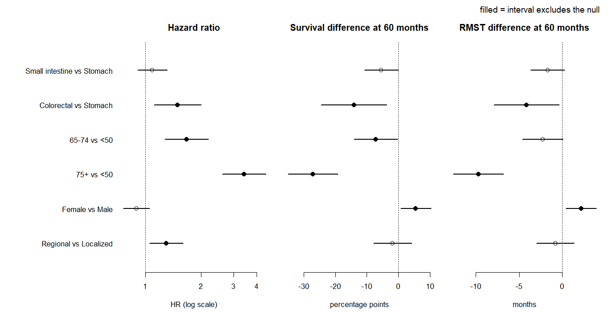

<!-- README.md is generated from README.Rmd. Please edit that file. -->

# gistsurv

Site- and age-stratified survival and competing-risk analysis, packaged
from a SEER-based cohort study of gastrointestinal stromal tumour
(GIST).

按原发部位与年龄分层的生存分析与竞争风险分析。本包由一项基于 SEER 的
胃肠道间质瘤（GIST）队列研究的分析代码封装而成。

------------------------------------------------------------------------

## What it is for \| 做什么用

A survival difference between two groups can be reported as a hazard
ratio, as a difference in survival probability at a fixed horizon, or as
a difference in restricted mean survival time. The three are not
interchangeable: they can differ in size, in significance, and
occasionally in sign. This package computes all three side by side,
states whether they agree, and — when they do not — lets a
competing-risk analysis say why.

同一个生存差距，可以用风险比（HR）、某个时点的生存率之差、或限制平均生存
时间（RMST）之差来表达。三者并不等价：大小、显著性、偶尔连方向都会不同。
本包把三者并排算出来，给出一致性判定；不一致时，用竞争风险分析回答为什么。

**No SEER data are included or redistributed.** The example dataset is
simulated; every parameter behind it is a literal in
`data-raw/make-sim-gist.R`.

**本包不包含、也不转发任何 SEER 数据。** 示例数据是模拟生成的，
每一个参数都写在 `data-raw/make-sim-gist.R` 里。

## Installation \| 安装

``` r
# install.packages("remotes")
remotes::install_github("<user>/gistsurv")
```

## The seven functions \| 七个函数

| Function | What it returns | 做什么 |
|----|----|----|
| `prep_surv()` | `time_mo`, `event_os`, `event_cr` from raw registry columns | 由登记处的原始字段构造生存与竞争风险结局 |
| `tab_baseline()` | Table 1 with standardized mean differences | 基线特征表，报标准化均值差（SMD）而非 p 值 |
| `fit_km()` | medians, survival at fixed times, log-rank, reverse-KM follow-up | 中位生存、时点生存率、log-rank、反向 KM 随访（即逆向 Kaplan–Meier 法估计中位随访时间） |
| `fit_cox()` | hazard ratios **with** the proportional-hazards test | 风险比，并强制附上 PH 假定检验 |
| `calc_rmst()` | RMST per arm, difference, ratio, RMTL ratio | 各臂 RMST、差值、比值、RMTL 比 |
| `compare_estimands()` | the three estimands side by side, plus a verdict | 三个估计量并排 + 一致性判定 |
| `fit_competing()` | CIF, Gray’s test, Fine–Gray, cause-specific Cox | 累积发生率（CIF）、Gray 检验、Fine–Gray、死因别 Cox |

Every function returns a data frame and **prints nothing**; diagnostics
travel back as attributes. No column name is hard-coded — every variable
is an argument. An undeclared value is an error, never a silent recode.

每个函数都返回 data frame 且**不打印任何东西**，诊断信息挂在 attributes
上。
没有任何列名写死在代码里，变量一律作为参数传入。没有声明过的取值一律报错，
绝不静默改编码。

## A worked example \| 一个完整例子

``` r
library(gistsurv)

# sim_gist arrives as a registry extract does: a follow-up time, a vital
# status, and a cause of death. prep_surv() builds the event indicators.
# sim_gist 的形态就是登记处导出的样子：随访时间、生存状态、死因。
# 由 prep_surv() 构造事件指示变量。
d <- prep_surv(
  sim_gist,
  time                = "time_mo",
  status              = "vital_status",
  cause               = "cause_of_death",
  cause_gist_value    = "Dead (attributable to this cancer dx)",
  cause_other_value   = "Other cause",
  cause_unknown_value = "Dead (missing/unknown COD)",
  cause_censor_value  = NA,
  cause_unknown_to    = 2L
)

# the event_os x event_cr cross-check, enforced before the data are returned
# 返回前强制核对的 event_os x event_cr 交叉表
attr(d, "os_cr_table")
#>         event_cr
#> event_os   0   1   2
#>        0 636   0   0
#>        1   0 332 232
```

``` r
ce <- compare_estimands(d, group = "sex", arms = c("Male", "Female"),
                        tau = c(12, 36, 60))
ce[, c("tau", "hr_txt", "km_surv_diff_txt", "rmst_diff_txt", "verdict")]
#>   tau           hr_txt  km_surv_diff_txt     rmst_diff_txt
#> 1  12 0.89 (0.76-1.05)  3.9 (1.3 to 6.6) 0.1 (-0.0 to 0.3)
#> 2  36 0.89 (0.76-1.05) 3.5 (-0.4 to 7.5)  1.0 (0.2 to 1.9)
#> 3  60 0.89 (0.76-1.05) 5.5 (0.7 to 10.4)  2.2 (0.4 to 3.9)
#>                                                                                     verdict
#> 1  DISCORDANT (significance): 1 of 3 significant, same direction (HR ns / KM sig / RMST ns)
#> 2  DISCORDANT (significance): 1 of 3 significant, same direction (HR ns / KM ns / RMST sig)
#> 3 DISCORDANT (significance): 2 of 3 significant, same direction (HR ns / KM sig / RMST sig)
```

Same contrast, same data, three answers — and, in two of the three, a
different answer at each horizon. The hazard ratio has no horizon and is
not significant. The survival difference is significant at 12 and 60
months but not at 36. The RMST difference is the other way round: not
significant at 12, significant at 36 and 60. A paper that reported one
estimator at one horizon could have concluded almost anything here.

同一个对比、同一份数据，三个答案 ——
而且其中两个还随时点变。风险比没有时点， 不显著；生存率之差在 12 和 60
个月显著、36 个月不显著；RMST 之差反过来， 12 个月不显著、36 和 60
个月显著。只报一个估计量、一个时点的话，这里几乎
想得出什么结论就能得出什么结论。

## Where the three estimators part company \| 三者在哪里分道扬镳



Six pre-specified contrasts, one row each, the same 60-month horizon
throughout. Read across a row: a row that is filled in one panel and
hollow in another is a contrast whose conclusion depends on which
estimator you chose to report. Three of these six are like that.

六个预先设定的对比，每行一个，横轴统一取 60
个月。横着读一行：某一格实心、
另一格空心，就意味着这个对比的结论取决于你选用哪个估计量。
六个里有三个如此。

    #>                     contrast n_significant
    #> 1 Small intestine vs Stomach             0
    #> 2      Colorectal vs Stomach             3
    #> 3               65-74 vs <50             2
    #> 4                 75+ vs <50             3
    #> 5             Female vs Male             2
    #> 6      Regional vs Localized             1
    #>                                                verdict
    #> 1 concordant: all three non-significant, same directio
    #> 2    concordant: all three significant, same direction
    #> 3 DISCORDANT (significance): 2 of 3 significant, same 
    #> 4    concordant: all three significant, same direction
    #> 5 DISCORDANT (significance): 2 of 3 significant, same 
    #> 6 DISCORDANT (significance): 1 of 3 significant, same

## Why they disagree \| 为什么会不一致

Deaths from other causes remove people from the risk set without being
the event of interest, and the three estimators absorb that differently.
`fit_competing()` separates the two.

死于其他原因的人会离开风险集，但那并不是我们关心的事件；三个估计量对这件事
的处理方式不同。`fit_competing()` 把两者拆开。

``` r
fc <- fit_competing(d, group = "age_grp", covariates = "age_grp", times = 60,
                    cause_labels = c("Disease", "Other causes"),
                    cause_specific = "skip")
fg <- attr(fc, "finegray")
fg[fg$variable == "age_grp", c("cause_label", "level", "n_event_cause",
                               "shr_txt", "p_fmt")]
#>    cause_label level n_event_cause            shr_txt  p_fmt
#> 1      Disease   <50            66   1.00 (reference)   <NA>
#> 2      Disease 50-64            99   0.80 (0.59-1.08)  0.151
#> 3      Disease 65-74            92   0.98 (0.72-1.34)  0.917
#> 4      Disease   75+            75   1.01 (0.73-1.41)  0.948
#> 5 Other causes   <50            11   1.00 (reference)   <NA>
#> 6 Other causes 50-64            45   2.33 (1.21-4.50)  0.011
#> 7 Other causes 65-74            65   4.56 (2.41-8.62) <0.001
#> 8 Other causes   75+           111 11.65 (6.27-21.65) <0.001
```

Across age the disease-specific subdistribution hazard barely moves; the
other-cause one rises by an order of magnitude. An overall-survival
comparison adds the two together and reports the sum as though it
described the disease.

随年龄变化，本病的亚分布风险比（sHR）几乎不动，而他因的上升了一个数量级。
总生存的比较把两者加在一起，把相加后的结果当作对本病的描述来报告。

## What the functions refuse to do \| 函数拒绝做的事

- `prep_surv()` — an undeclared cause of death; a living subject
  carrying a cause of death; `cause_unknown_to = 0`.
  未声明的死因；活人带着死因；`cause_unknown_to = 0`。
- `fit_km()` — a time point past a stratum’s follow-up, unless told to
  return `NA` there. 超出某一层随访的时点，除非明确要求返回 `NA`。
- `fit_cox()` — hazard ratios whose proportional-hazards test could not
  be computed. 无法算出 PH 检验时，拒绝返回风险比。
- `calc_rmst()` — a `tau` past the follow-up of either arm.
  `survRM2::rmst2()` on its own returns a number there. 超出任一臂随访的
  `tau`。若直接调用 `survRM2::rmst2()`，该函数是会照常计算的。
- `fit_competing()` — an `event_os` that contradicts `event_cr`, checked
  before anything is fitted. 与 `event_cr` 矛盾的
  `event_os`，在拟合任何模型之前查。

## Documentation \| 文档

``` r
vignette("compare-estimands", package = "gistsurv")   # the full walkthrough
?sim_gist                                              # the example data
```

## License \| 许可

MIT © Yue Yang
