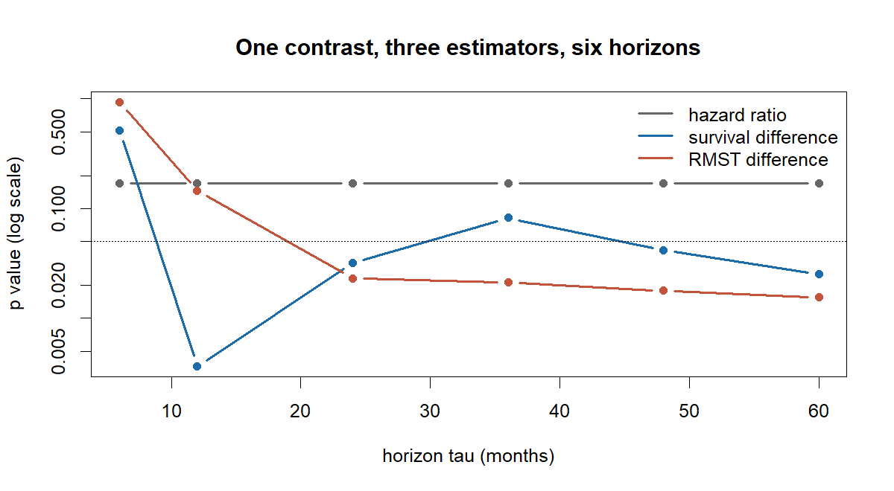

<!-- README.md is generated from README.Rmd. Please edit that file. -->

# gistsurv

`gistsurv` reports a survival difference three ways at once — hazard
ratio, survival difference at a fixed horizon, and restricted mean
survival time difference — and tells you whether the three agree.

`gistsurv` 把同一个生存差距用三种方式同时报出来 ——
风险比、固定时点的生存率 之差、限制平均生存时间（RMST）之差 ——
并告诉你三者是否一致。

## Why \| 为什么需要它

A hazard ratio is one number standing in for a whole curve, and it means
what it claims only if the ratio stays roughly constant over time — an
assumption that fails quietly and often. It also has no horizon built
into it, so it cannot answer the question a patient actually asks: how
much longer, on average, over the next five years. The restricted mean
survival time answers exactly that, assumes no proportionality, and is
denominated in months — so when it parts company with the hazard ratio,
the disagreement is itself a finding rather than a nuisance.

风险比是用一个数去代表整条曲线，只有当这个比值随时间大致恒定时它才名副其实
——
而这个假定经常悄无声息地不成立。它本身也不含时间跨度，因此回答不了病人真正
关心的问题：在未来五年里，平均能多活多久。RMST
恰好回答这个问题，不需要比例 风险假定，而且单位就是月 ——
所以当它与风险比给出不同结论时，这个分歧本身就是
一项发现，而不是需要掩盖的麻烦。

## Installation \| 安装

``` r
# install.packages("remotes")
remotes::install_github("8YyVe86/gistsurv")
```

## 30-second start \| 三十秒上手

``` r
library(gistsurv)

d  <- prep_surv(sim_gist, cause = "cause_of_death",
                cause_gist_value    = "Dead (attributable to this cancer dx)",
                cause_other_value   = "Other cause",
                cause_unknown_value = "Dead (missing/unknown COD)",
                cause_censor_value  = NA)

ce <- compare_estimands(d, group = "sex", arms = c("Male", "Female"),
                        tau = c(6, 12, 24, 36, 48, 60))

ce[, c("tau", "hr_txt", "km_surv_diff_txt", "rmst_diff_txt")]
#>   tau           hr_txt  km_surv_diff_txt      rmst_diff_txt
#> 1   6 0.89 (0.76-1.05) 0.6 (-1.3 to 2.5) -0.0 (-0.1 to 0.1)
#> 2  12 0.89 (0.76-1.05)  3.9 (1.3 to 6.6)  0.1 (-0.0 to 0.3)
#> 3  24 0.89 (0.76-1.05)  3.7 (0.3 to 7.0)   0.6 (0.1 to 1.1)
#> 4  36 0.89 (0.76-1.05) 3.5 (-0.4 to 7.5)   1.0 (0.2 to 1.9)
#> 5  48 0.89 (0.76-1.05)  4.7 (0.2 to 9.1)   1.6 (0.3 to 2.9)
#> 6  60 0.89 (0.76-1.05) 5.5 (0.7 to 10.4)   2.2 (0.4 to 3.9)

matplot(ce$tau, ce[, c("hr_p", "km_surv_diff_p", "rmst_diff_p")], type = "b",
        log = "y", pch = 16, lty = 1, lwd = 2, col = c("grey40", "#1b6ca8", "#c1543a"),
        xlab = "horizon tau (months)", ylab = "p value (log scale)",
        main = "One contrast, three estimators, six horizons")
abline(h = 0.05, lty = 3)
legend("topright", c("hazard ratio", "survival difference", "RMST difference"),
       col = c("grey40", "#1b6ca8", "#c1543a"), lwd = 2, bty = "n")
```



Same data, same contrast. The hazard ratio is a flat line because it has
no horizon: one number, p = 0.170, whatever you ask it about. The other
two cross 0.05 at different places, so the conclusion depends on which
estimator is reported and at which horizon — which is the thing this
package exists to make visible rather than to hide.

同一份数据、同一个对比。风险比是一条水平线，因为它本身不含时间跨度：无论问
哪个时点，都是同一个数（p = 0.170）。另外两个则在 不同的位置跨过 0.05 ——
结论取决于你报哪个估计量、报哪个时点。把这件事显示
出来，正是本包存在的理由。

## The seven functions \| 七个函数

| Function | What it returns | 做什么 |
|----|----|----|
| `prep_surv()` | `time_mo`, `event_os`, `event_cr` from raw registry columns | 由登记处的原始字段构造生存与竞争风险结局 |
| `tab_baseline()` | Table 1 with standardized mean differences | 基线特征表，报标准化均值差（SMD）而非 p 值 |
| `fit_km()` | medians, survival at fixed times, log-rank, reverse-KM follow-up | 中位生存、时点生存率、log-rank、反向 KM 随访（即逆向 Kaplan–Meier 法估计中位随访时间） |
| `fit_cox()` | hazard ratios **with** the proportional-hazards test | 风险比，并强制附上 PH 假定检验 |
| `calc_rmst()` | RMST per arm, difference, ratio, RMTL ratio | 各臂 RMST、差值、比值、RMTL 比 |
| `compare_estimands()` | the three estimands side by side, plus a verdict | 三个估计量并排 + 一致性判定 |
| `fit_competing()` | CIF, Gray’s test, Fine–Gray, cause-specific Cox | 累积发生率（CIF）、Gray 检验、Fine–Gray、死因别 Cox |

Every function returns a data frame and prints nothing; diagnostics
travel back as attributes. No column name is hard-coded — every variable
is an argument. An undeclared value is an error, never a silent recode.
Several calls stop rather than return a number that would be read as an
estimate: a `tau` past the follow-up of either arm, a time point past a
stratum’s follow-up, a hazard ratio whose proportional-hazards test
could not be computed, an `event_os` that contradicts `event_cr`. The
full walkthrough is
`vignette("compare-estimands", package = "gistsurv")`.

每个函数都返回 data frame 且不打印任何东西，诊断信息挂在 attributes
上。没有
任何列名写死在代码里，变量一律作为参数传入。没有声明过的取值一律报错，绝不
静默改编码。若某个数字一旦返回就会被当成估计值来读，函数宁可停机：超出任一臂
随访的 `tau`、超出某一层随访的时点、算不出 PH 检验的风险比、与
`event_cr` 矛盾的 `event_os`。完整走查见
`vignette("compare-estimands", package = "gistsurv")`。

## Paper and data statement \| 关联论文与数据声明

This package packages the analysis code of a study of site- and
age-stratified survival and competing-risk mortality in gastrointestinal
stromal tumour, using the SEER Research Data (17 registries, diagnoses
2000–2019). Manuscript in preparation; this section will carry the
citation and DOI once they exist.

本包封装的是一项研究的分析代码：胃肠道间质瘤按原发部位与年龄分层的生存与竞争
风险死亡分析，数据为 SEER Research Data（17 个登记处，诊断年
2000–2019）。 论文撰写中；正式发表后本节将补上引用与 DOI。

**The example dataset `sim_gist` is simulated. This package contains no
individual-level SEER data and does not distribute any.** Every
parameter behind `sim_gist` is a literal in `data-raw/make-sim-gist.R`,
which opens no file; the dataset shares no record with any real cohort.
Using the package on SEER data requires your own Research Data Use
Agreement with the National Cancer Institute.

**示例数据 `sim_gist` 为模拟生成。本包不含也不分发任何 SEER 个案数据。**
`sim_gist` 背后的每一个参数都写死在 `data-raw/make-sim-gist.R`
里，该脚本不
读取任何文件；这份数据与任何真实队列没有一条记录重合。若要把本包用于
SEER 数据，需你自己与美国国立癌症研究所签署 Research Data Use
Agreement。

MIT © Yue Yang
